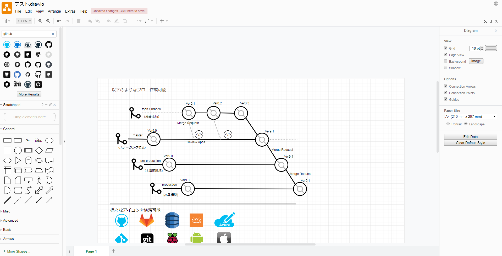

# drawioに関するメモ

## drawioについて
[draw\.io](https://www.draw.io/)
ブラウザ上で各種フローや図形を描画できるサービス。

## データ保存
* ローカル保存以外に、GoogleDrive、GitHub、Dropboxなどと連携できる
* SVG出力可（jpeg,png,pdf,hmtlなど他にも様々な形式に対応）

drawioで図形作成→githubに直接Save/Exportが非常に便利。リポジトリも指定できます。

## テンプレートとして利用可能な図(抜粋）
* 基本的な図形
* フローチャート
* UML
* ER図

## 図形・アイコン検索
様々なアイコンを検索可能
* AWSの各サービスの図なども有り

## 編集画面のイメージ

